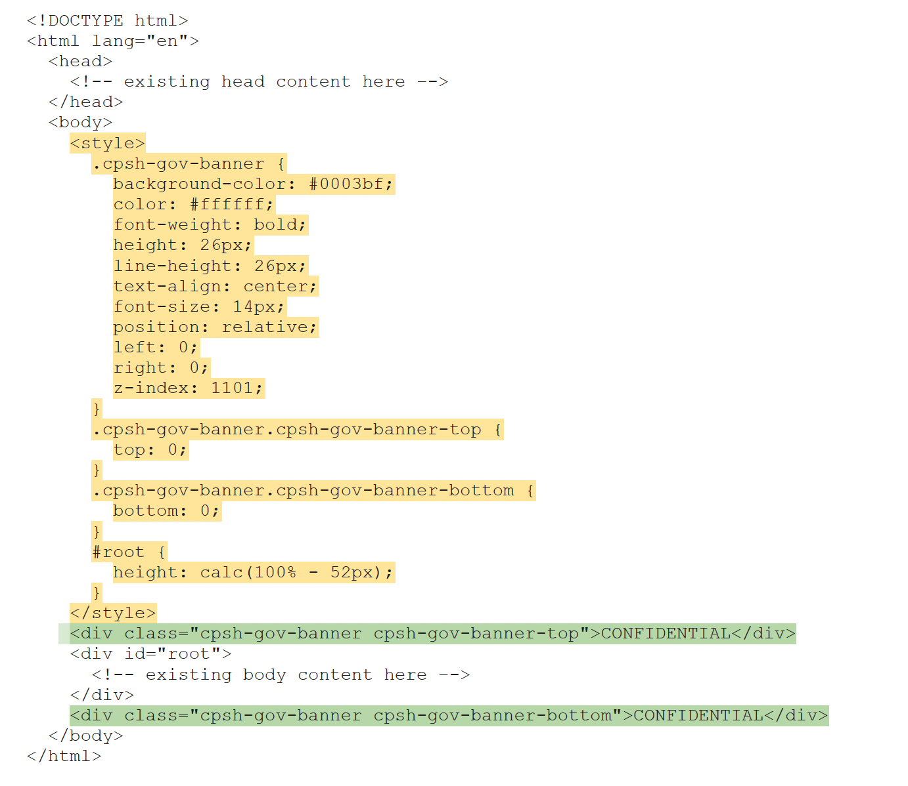
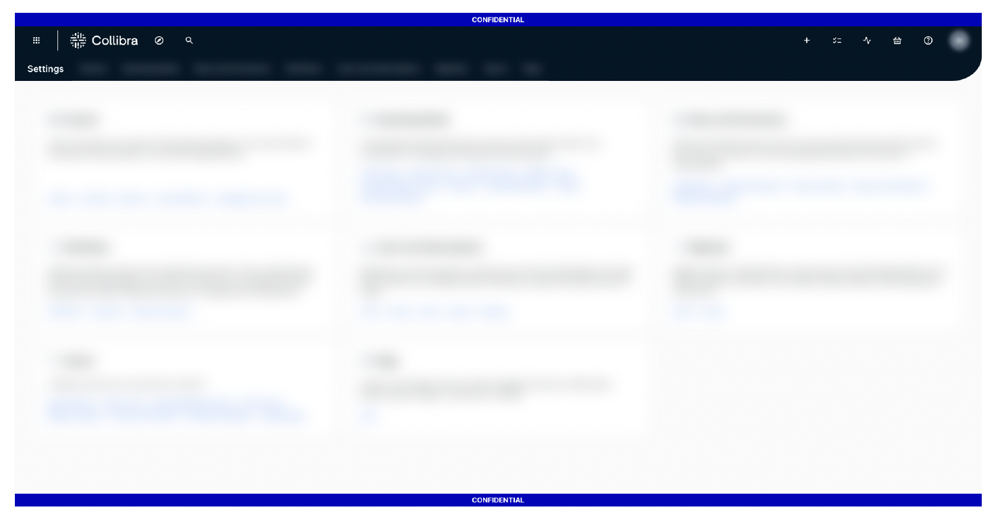

# Create a custom header and footer in CPSH

1. Locate the `index.html` file in the subdirectory of the data directory `collibra_data/dgc/static/banyan`.

2. Open this file in a plain text editor. In the HTML file, inside the `<body>` tags, there is a `
` element with the attribute `id="root"`.

3. Make the following changes to the file:

   a. Place another `
` before and/or after the `
` to be used for the header banner and/or footer banner.  
      (See green highlighted code in the example below)

      i. Within these `
` elements, add the text you want to show in each banner, respectively.  

      ii. Make sure the `
` tags have classes to target any styling needs.

   b. To add the styling for the new `
` elements, add a `<style>` block immediately after the `<body>` tag.  
      (See yellow highlighted code in the example below)

4. Save the file.

5. Restart your environment.

Example:

The HTML snippet below shows simple banners that use this approach. It demonstrates the HTML code to add custom banners (highlighted in yellow and green) and how the banners appear in the Collibra UI. NOTE: The `<html>`, `<head>` and `<body>` tags have been simplified for demonstration purposes. The `index.html` page you see may look different.

HTML snippet:

Result in Collibra UI:

Important: 

- Any modifications made to the CPSH `index.html` file and/or location will be overwritten during the next software update, so be sure to save your modifications elsewhere before an upgrade.

- Any impact of custom banners on 508 compliance or accessibility are the responsibility of the customer.