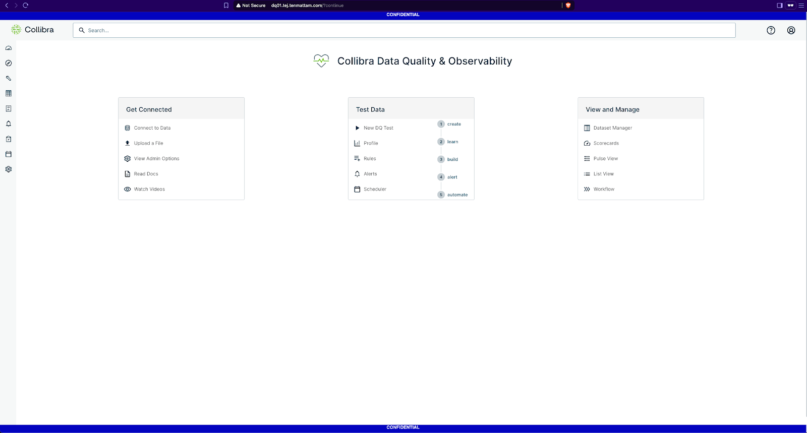

# Create a custom header and footer in Collibra Data Quality & Observability

There are two workarounds - one with Nginx and the other with Apache HTTP 2.4. Both options are documented in this repository. Apache HTTP 2.4 consumes ~80 MB RAM vs. ~20 MB for Nginx.

## Reverse-proxy injection via Nginx sub_filter

## Prerequisites

| Item         | Details                                                                 |
|--------------|-------------------------------------------------------------------------|
| DQO front-end | Running on `localhost:9000` (default self-host install).                |
| Privileges    | Root or sudo on the same host.                                          |
| SELinux       | If enforcing, run `setsebool -P httpd_can_network_connect 1`.           |
| DNS / TLS     | Optional; HTTP is enough for the banner.                                |

---

## Install Nginx:

```bash
sudo dnf install -y nginx
sudo systemctl enable --now nginx
```

## Create the proxy & banner config:

```bash
vi /etc/nginx/conf.d/dqo.conf

# /etc/nginx/conf.d/dqo.conf
server {
    listen 80;
    server_name dq01.tej.tenmattam.com;

    location / {
        proxy_pass http://127.0.0.1:9000;
        proxy_set_header Host $host;
        proxy_set_header X-Real-IP $remote_addr;
        proxy_set_header Accept-Encoding "";
        gunzip on;

        sub_filter_types text/html;
        sub_filter_once  off;

        # inject right after the FULL <body> tag
        sub_filter '<body>' '<body>
        <div class="gov-banner-top">CONFIDENTIAL</div>
        <div class="gov-banner-bot">CONFIDENTIAL</div>
        <style>
        .gov-banner-top,.gov-banner-bot{
            position:fixed;left:0;right:0;height:26px;line-height:26px;
            background:#0003bf;color:#fff;font:bold 14px sans-serif;
            text-align:center;pointer-events:none;z-index:2147483647}
        .gov-banner-top{top:0}
        .gov-banner-bot{bottom:0}
        body{padding-top:26px;padding-bottom:26px}
        </style>';
    }

    proxy_hide_header Content-Security-Policy;
}
```

## Validate & reload Nginx:

```bash
sudo nginx -t
sudo systemctl reload nginx
```
## Verify the banners

```bash
curl -s http://dq01.example.com/login | grep CONFIDENTIAL
# You should see two injected lines (<div> and <style>)
```

Open a browser tab – a blue strip now appears at the very top and bottom of every screen (login + in-app).



## Reliability & patching concerns:

| Concern                  | Mitigation |
|---------------------------|------------|
| “Un-supported workaround” | Nginx is fully open-source, packaged by Red Hat/EPEL. We keep the configuration strictly limited to reverse-proxy + sub_filter; if Nginx stops, we can bypass via port 9000 in seconds. |
| Risk to uptime            | Nginx runs in its own systemd service; we can add it to the Collibra start/stop scripts or supervise with systemd-watchdog. Memory footprint < 20 MB. |
| Patching cadence          | Red Hat back-ports CVE fixes every 4–6 weeks. Updating is a single dnf update nginx and 1-second reload (`systemctl reload nginx`) – no Collibra restart required. |
| Single point of failure   | If a second node is added later, the same 4-line config can be placed behind the load balancer, or we can run two Nginx instances with keepalived for VIP fail-over. |


## Traffic flow & banner visibility:

The “CONFIDENTIAL” banner is injected by Nginx reverse-proxy, not by the Collibra application itself. Any user who reaches the service through the canonical DNS name – `http(s)://dq01.example.com (ports 80/443)` – is automatically routed through that proxy and therefore always sees the banner. However, if someone bypasses DNS and goes straight to the DQO process on its internal port (`http://dq01.example.com:9000` or the node’s raw IP + 9000), their request never touches Nginx and the banner will not be present. In production we prevent such “direct-port” access with a firewall rule and ask users to bookmark only the proxy URL; this guarantees that every page is served through Nginx and remains compliant with the banner requirement.

## Upgrade notes:

- All changes live only in /etc/nginx/conf.d/dqo.conf. Upgrading or re-deploying DQO does not overwrite the banner.
- After patching DQO, simply test the URL once - no additional steps.
- To change banner text or color later, edit the `<style> / <div>` in the same file and reload Nginx.

